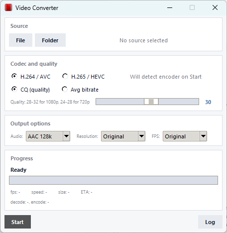

# Vaizdo konverteris (Video Converter)

Galinga ir efektyvi vaizdo failų konvertavimo programa, optimizuota masiniam ir vienetiniam vaizdo srautų apdorojimui, naudojant techninės įrangos spartinimą (NVIDIA NVENC/NVDEC, AMD AMF).

## Funkcijos

- **Aparatinis spartinimas:** Pilnas `NVIDIA` (NVENC/NVDEC via CUDA) ir `AMD` (AMF via D3D11VA/DXVA2) palaikymas. Vaizdo išpakavimas, filtravimas ir kodavimas vyksta tiesiogiai vaizdo plokštės VRAM atmintyje.
- **Išmanusis mastelio keitimas:** Automatinis perjungimas tarp programinio `scale` ir aparatinio `scale_cuda` filtro, išlaikant maksimalų FPS.
- **Main 10 (10-bit HEVC) konversija:** Sklandus 10-bit HEVC šaltinių konvertavimas į itin suderinamą 8-bit H.264 (`yuv420p`) formatą tiesiogiai GPU viduje.
- **Lankstus kokybės valdymas:** Palaiko fiksuotos kokybės (CRF/CQ) ir tikslinio bitų srauto (VBR su automatiniu `$1:4$` maxrate piko saugikliu) režimus.
- **Audio apdorojimas:** Automatinis garso takelių aptikimas ir konvertavimas į suderinamą AAC formatą.

## Architektūra

Projektas išskaidytas į tris vienos atsakomybės modulius:
1. `hardware.py` – sistemos resursų, prieinamų FFmpeg enkoderių ir aparatinių spartintuvų aptikimas.
2. `ffmpeg_engine.py` – deterministinis FFmpeg komandų generavimas ir filtrų grandinių valdymas.
3. `converter.py` – Tkinter GUI grafinė sąsaja ir konvertavimo srauto valdymas.

## Paleidimas iš kodo

### Reikalavimai
- Python 3.10+
- `ffmpeg` ir `ffprobe` vykdomieji failai turi būti sisteminiame PATH arba tame pačiame aplanke šalia kodo.